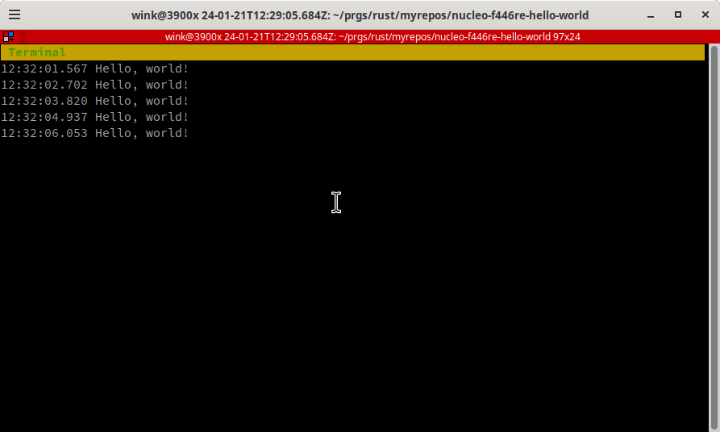

# nucleo-f446re-hello-world

This a minimal version of [hello-world](https://probe.rs/docs/tools/cargo-embed/#target)
from probe-rs. It is intended to be used as a template for other projects and
shows using RTT logging.

# Pre-requisites

TODO: Add pre-requisites

# Build and run using `cargo run`

```
wink@3900x 24-01-21T20:24:36.443Z:~/prgs/rust/myrepos/nucleo-f446re-hello-world (main)
$ cargo run 
   Compiling hello-world v0.1.0 (/home/wink/prgs/rust/myrepos/nucleo-f446re-hello-world)
    Finished dev [unoptimized + debuginfo] target(s) in 0.08s
     Running `probe-rs run --chip STM32F446RETx target/thumbv7em-none-eabi/debug/hello-world`
      Erasing ✔ [00:00:00] [###############################################################################################################] 16.00 KiB/16.00 KiB @ 40.22 KiB/s (eta 0s )
  Programming ✔ [00:00:00] [###############################################################################################################] 10.00 KiB/10.00 KiB @ 36.03 KiB/s (eta 0s )    Finished in 0.692s
Hello, world!
Hello, world!
Hello, world!
Hello, world!
^C
wink@3900x 24-01-21T20:25:20.029Z:~/prgs/rust/myrepos/nucleo-f446re-hello-world (main)
$ 
```

# Build and run using cargo-embed

Run `cargo embed with_rtt` to build and flash the program to the target
and the result should be a screen that looks like this:



After hitting `Ctrl-C` to stop the program, the output should look like this:
```
wink@3900x 24-01-21T20:28:27.434Z:~/prgs/rust/myrepos/nucleo-f446re-hello-world (main)
$ cargo embed with_rtt
    Finished dev [unoptimized + debuginfo] target(s) in 0.01s

      Config with_rtt
      Target /home/wink/prgs/rust/myrepos/nucleo-f446re-hello-world/target/thumbv7em-none-eabi/debug/hello-world
     Erasing sectors ✔ [00:00:00] [########################################################################################################] 16.00 KiB/16.00 KiB @ 40.09 KiB/s (eta 0s )
 Programming pages   ✔ [00:00:00] [########################################################################################################] 10.00 KiB/10.00 KiB @ 36.31 KiB/s (eta 0s )    Finished flashing in 0.693s
Shutting down.
wink@3900x 24-01-21T20:28:40.200Z:~/prgs/rust/myrepos/nucleo-f446re-hello-world (main)
```

Note if you forget to add the 'with_rtt' argument you'll see the following only:
```
wink@3900x 24-01-21T20:42:27.282Z:~/prgs/rust/myrepos/nucleo-f446re-hello-world (main)
$ cargo embed
    Finished dev [unoptimized + debuginfo] target(s) in 0.01s
      Config default
      Target /home/wink/prgs/rust/myrepos/nucleo-f446re-hello-world/target/thumbv7em-none-eabi/debug/hello-world
     Erasing sectors ✔ [00:00:00] [########################################################################################################] 16.00 KiB/16.00 KiB @ 40.03 KiB/s (eta 0s )
 Programming pages   ✔ [00:00:00] [########################################################################################################] 10.00 KiB/10.00 KiB @ 36.51 KiB/s (eta 0s )    Finished flashing in 0.692s
        Done processing config default
wink@3900x 24-01-21T20:42:34.334Z:~/prgs/rust/myrepos/nucleo-f446re-hello-world (main)
```

## License

Licensed under either of

- Apache License, Version 2.0 ([LICENSE-APACHE](LICENSE-APACHE) or http://apache.org/licenses/LICENSE-2.0)
- MIT license ([LICENSE-MIT](LICENSE-MIT) or http://opensource.org/licenses/MIT)

### Contribution

Unless you explicitly state otherwise, any contribution intentionally submitted
for inclusion in the work by you, as defined in the Apache-2.0 license, shall
be dual licensed as above, without any additional terms or conditions.
